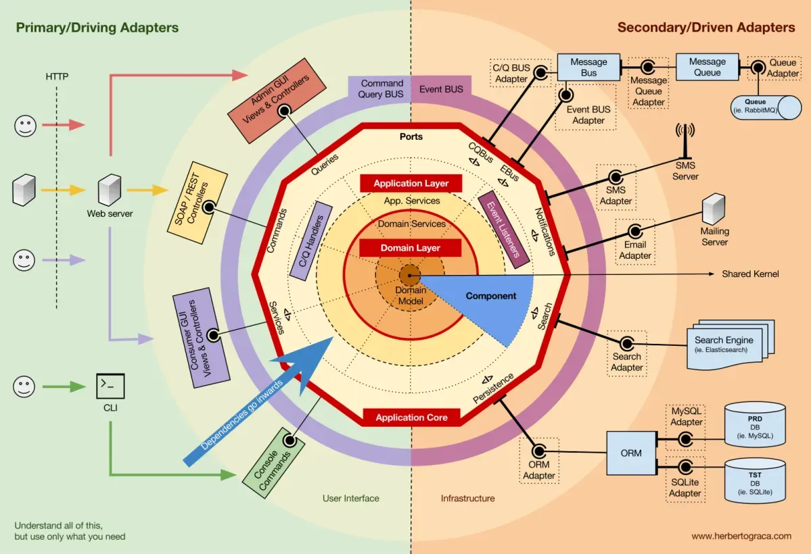

# Les types d'architectures

- Monolithique
- Microservice
- Event-Driven
- Hexagonale

## Travail à faire en solo

Faire un travail de recherche sur les 4 types d'architecture précités. Pour chacun, récupérer : 

- une liste de caractéristiques
- une définition simple et efficace - avec vos mots
- une liste d'utilisation dans des projets connus
- la liste des sources utilisées

## TP 2

Je veux que vous refassiez le schéma ci-dessous, étape par étape : 

L'objectif est réellement de comprendre chaque élément du schéma, de manière progressive.
Le travail est à faire sur un doc à rendre en PDF, et les schémas doivent être lisibles.